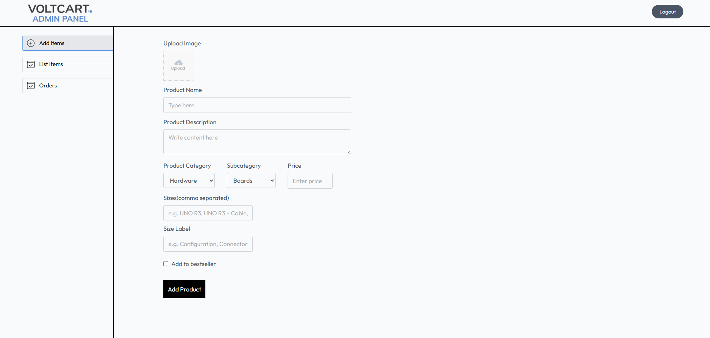
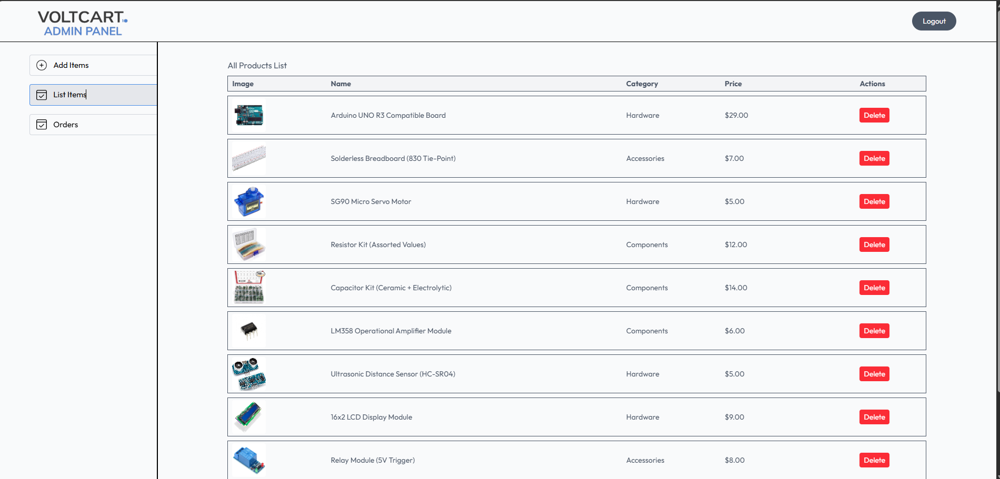
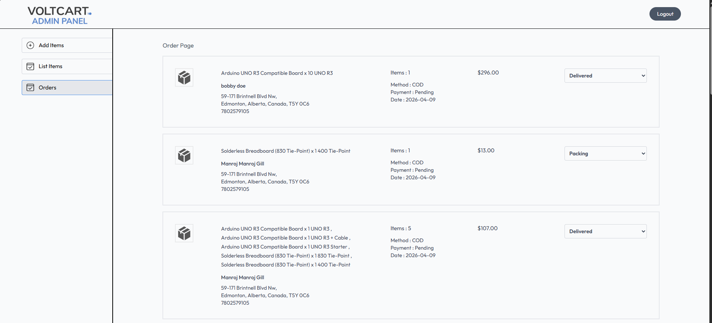

# ⚡ VoltCart Admin Panel  
**Product & Order Management Dashboard for VoltCart**

---

## 📌 Overview  
The VoltCart Admin Panel is a dedicated dashboard used to manage products and monitor orders within the VoltCart e-commerce system.  

It provides secure access for administrators to control inventory, upload products, and track customer orders through an intuitive interface connected to the backend API.

---

## 🚀 Highlights  
- Secure admin-only access using JWT authentication  
- Integrated with backend REST API  
- Real-time product and order management  
- Image upload support via Cloudinary  

---

## ✨ Key Features  

### 📦 Product Management
- Add new products with image uploads  
- Define product details (name, description, category, price, variants)  
- Maintain and view full product inventory  

### 🧾 Order Management
- View all customer orders  
- Access order details including items and totals  
- Track order activity through the dashboard  

---

## 📸 Dashboard Preview  

### ➕ Add Product  

### 📦 Product Inventory  

### 🧾 Orders Management  

---

## 🧠 Engineering Concepts Demonstrated  
- Role-based access control (admin-only routes)  
- Integration with protected backend endpoints  
- Handling form data and file uploads  
- State management for admin workflows  
- Separation of admin and user-facing systems  

---

## 🛠️ Tech Stack  

- React  
- JavaScript (ES6+)  
- Tailwind CSS  
- React Router  
- Axios / Fetch API  

---

## ⭐ Final Note  
The VoltCart Admin Panel demonstrates the ability to build internal tools for managing application data, including inventory and orders. It highlights practical experience with dashboards, protected routes, and full-stack integration.